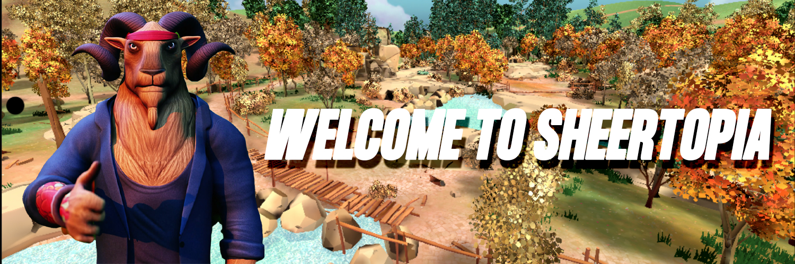

# 🌏 Sheertopia

<figure><figcaption></figcaption></figure>

**Introduction**

Sheertopia, a groundbreaking open-world role-playing game, seamlessly blends traditional web2 gaming elements with the innovative features of the web3 realm. This game stands out for its dedication to creating a secure and inclusive environment, addressing the gaming community's challenges with toxicity, including bullying, racism, and grooming.

**Gameplay and Technology**

At the core of Sheertopia's appeal is the use of AI-driven non-player characters (NPCs), powered by ChatGPT’s API. This integration elevates the gaming experience, providing players with interactive and intelligent NPCs, thereby enhancing realism and immersion within the game.

The Gen-S Battleground is another innovative feature in Sheertopia. Here, players can engage in competitive mini-games, adding an element of excitement through in-game wagering and rewards. These mini-games not only serve as an entertainment source but also as a means for players to gain in-game achievements.

**Accessibility and Development**

Sheertopia is designed for broad accessibility, offering a free-to-play model on smartphone devices. The game, titled "Rise of Sheertopia," is currently in a closed beta stage on both the Apple App Store and Google Play Store.

The development team behind Sheertopia comprises over 20 experts with diverse backgrounds and experience from various top-tier companies. This team's expertise ensures that Sheertopia is developed to the highest standards, combining innovative ideas with solid gaming principles.

**Roadmap and Future Plans**

The development of Sheertopia has followed a structured roadmap, including a completed pre-seed funding round and also partnering with major Web3 platforms and brands. The roadmap also outlines future objectives, such as the implementation of Token Generation Events and plans for listings on various exchanges. These steps are part of a broader strategy aimed at the continuous development and expansion of Sheertopia.

**Revenue Streams**

Sheertopia employs a multifaceted economic model. This includes in-game purchases where players can acquire skins, weapons, and other enhancements. The game also incorporates NFT sales, offering unique digital assets like special in-game items, characters, and rewards. Additionally, staking rewards provide players with the opportunity to earn through various staking pools.

**Conclusion**

Sheertopia is not just a technological advancement in gaming; it is also a commitment to a safer, more inclusive gaming world. Its unique features, combined with its accessible platform, experienced development team, and strategic economic model, position Sheertopia to make a significant impact on the global gaming landscape, offering an engaging and responsible
