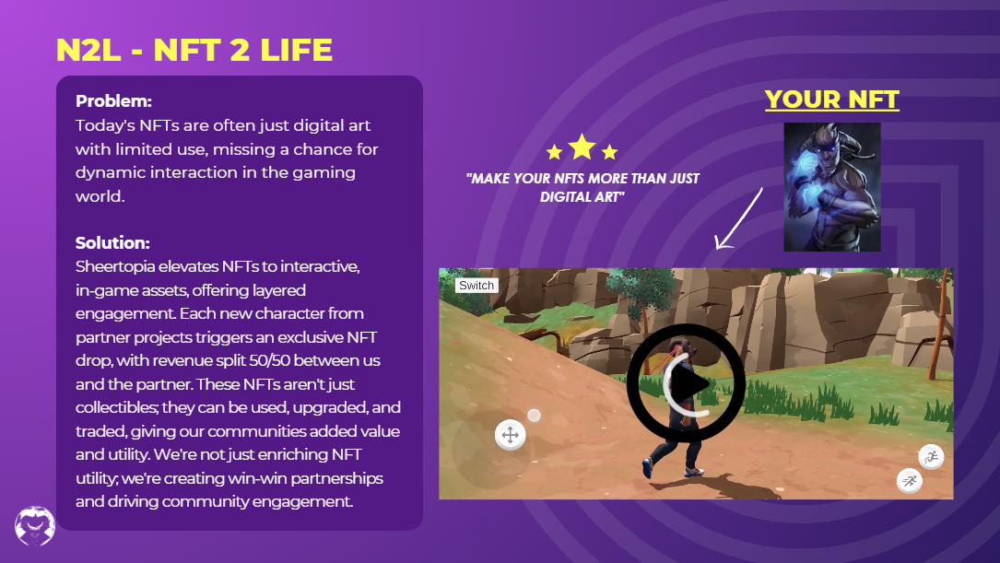

# 🚀 N2L - NFT 2 LIFE

<figure><figcaption></figcaption></figure>

**Benefits for Brand/Project Owners:**

In Sheertopia, the innovative N2L feature offers a seamless integration of NFTs into the game's expansive world. This integration allows brands or project owners to bring their NFT assets to life within the dynamic ecosystem of Sheertopia. Here's how N2L enhances the gaming experience:

1. **NFT Integration**: Brands or project owners can integrate their NFTs directly into Sheertopia. This allows for interactive and competitive use of their assets in the game’s vibrant environment, offering a new level of engagement for NFTs.
2. **Exclusive NFT Creation**: N2L provides an exclusive service for creating unique NFTs. This service enables brands to customize their characters with distinctive moves, fine-tune their combat and defense strategies, and design personalized skins. These features enhance the brand’s presence and uniqueness in the game. It's important to note that Sheertopia supports characters with human or animal features only.
3. **Benefits for NFT Owners**:
   * **Exclusive In-Game Assets and Skins**: Owning an NFT grants access to special in-game assets and skins, adding a layer of exclusivity and personalization.
   * **Empowering Gamers**: N2L is designed to democratize the gaming experience. Top-performing gamers, particularly those who reach the top 10 on our leaderboards, have the opportunity to earn these exclusive items, ensuring that high achievement in the game is rewarded regardless of financial capability.

Sheertopia, through N2L, is dedicated to creating a rewarding and engaging ecosystem for both NFT owners and gamers. This approach not only enhances the gaming experience but also opens up new avenues for brand interaction and gamer engagement within the virtual world. For more details about these exciting opportunities in Sheertopia, we invite interested parties to reach out and explore the possibilities.
