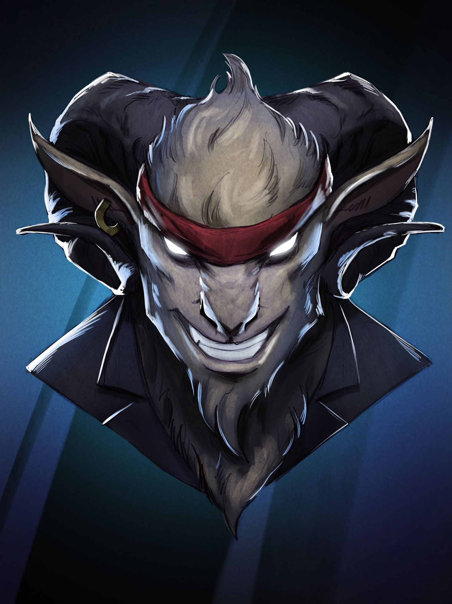

# 🕹️ Character Moves

### Mr Deimos&#x20;

Mr. Deimos is a powerful character in the game with a diverse set of moves. His melee attack, Ferocious Claws, allows him to efficiently take down enemies with precision and agility. He also has a defensive move called Hibernation that allows him to temporarily enter a state of deep sleep, reducing the damage taken from attacks. But when the situation calls for it, he unleash his ultimate move, the Bear Hug, a strategic throw attack that disables his opponents and giving him an upper hand in battle. These moves combined with his intimidating appearance make Mr Deimos a formidable opponent to any player who dare to cross his path.

<figure><figcaption></figcaption></figure>

Okami

The Okami is a fierce and formidable character in the game, feared by all who dare to cross his path. His melee attack, Canine Fury, is a whirlwind of teeth and claws that strike fear into the hearts of his enemies. He also has a defensive move called Moon Howl, where he calls upon the power of the moon to grant him extra energy and increase his strength in battle. But the true terror of Okami is his special move, Alpha Pack Attack, where he calls upon his pack to join the battle, unleashing a coordinated and devastating attack on his enemies. These moves combined with his intimidating appearance and reputation make the Okami a formidable opponent to any player who dare to challenge him.

<figure><figcaption></figcaption></figure>

### Princess Shibaa&#x20;

Princess Shibaa is a fierce and noble warrior in the game, feared by her enemies and revered by her allies. Her melee attack, Legs of Fury, is a display of her raw strength and speed as she unleashes a series of powerful kicks and strikes on her opponents. But she's not just a brawler, she also has a defensive move called Rapid Hooves, allowing her to gracefully dodge and evade her enemies' attacks for one turn. But when the situation calls for it, she unleashes her ultimate move, Sheers Unleashed, where she unsheathes her ancient shears and unleashes a series of precise and devastating stabs on her opponents, leaving them no chance of survival. These moves combined with her elegant appearance and noble personality make Princess Shibaa a formidable opponent to any player who dare to cross her path.

<figure><figcaption></figcaption></figure>

### Lambo (Apollo)

\
Lambo (Apollo), known as the ultimate champion in the game, has evolved with an arsenal of new and devastating abilities. His offensive capabilities now include the signature move "Gunfire Gambit," where he masterfully shoots with his high-caliber gun, delivering precise and damaging shots to his enemies. Additionally, Lambo showcases the innovative missile attack "Bionic Comet," launching a powerful projectile from a mechanism built into his arm, causing massive area damage.

His mastery over magic is evident in two of his other attacks. The first is an electric assault named "Volt Vortex," where he conjures and fires a bolt of electricity, capable of paralyzing and damaging his foes with its high voltage. The second magical attack, "Thunderclap," is even more awe-inspiring, as he summons and directs a fierce lightning strike, channeling the raw power of a storm against his enemies.

For defense, Lambo adopts a unique approach with "Ethereal Encasement," utilizing magic to create a protective shield. This innovative shield not only provides robust physical protection but also symbolizes a fusion of technology and sorcery, reflecting his adaptability and strategic depth.

This combination of high-tech weaponry, elemental magic, and an unbreakable defense makes Lambo (Apollo) a more versatile and formidable figure on the battlefield. His presence not only intimidates opponents but also offers a diverse range of tactical options for any player allied with him.

<figure><figcaption></figcaption></figure>
