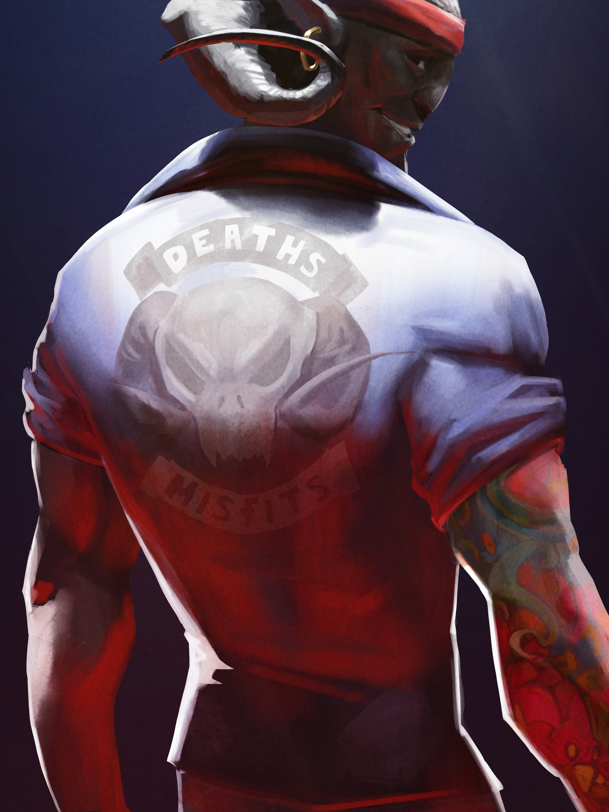
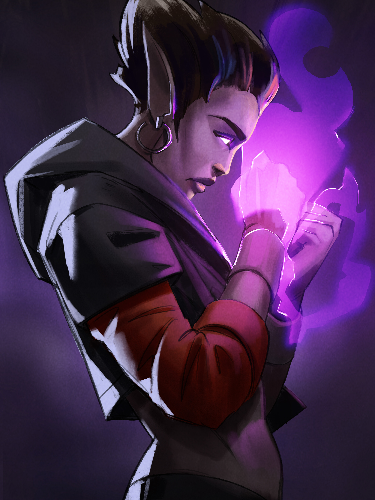
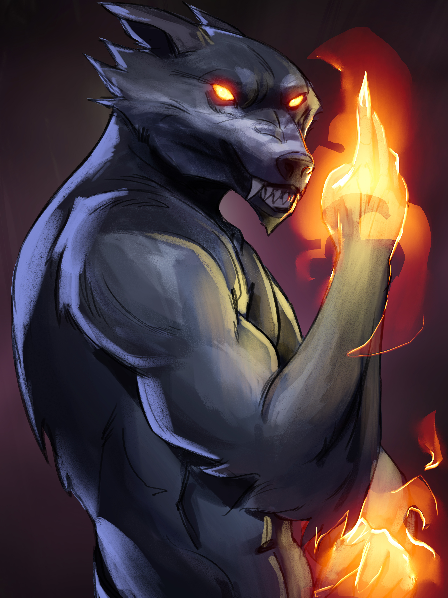

# 🐻 Meet The Characters

In a world shrouded in chaos and despair, one man emerges from the darkness to bring hope and unity. Meet Apollo "Lambo" - a visionary, a prodigy, and a guiding light to those who have lost their way. His brilliance and compassion radiate from every fiber of his being, inspiring those around him to strive for a world filled with peace and harmony. But even the greatest heroes have hidden depths.

A cryptic enigma lies beneath the surface - a mysterious sleeve tattoo that adorns Apollo's right arm. This intricate tapestry of ink tells a story unknown even to him. As the legend of Apollo "Lambo" grows, whispers of his moniker echo through the corridors of power, stirring intrigue and curiosity.

Why is he called Lambo? What ancient secrets does his tattoo hold? The answers lie shrouded in the mists of time, waiting to be revealed by those brave enough to embark on an epic journey of discovery. With each step you take, you will unravel the threads of his past, unearthing hidden truths and long-forgotten legends. As you venture deeper into the heart of the mystery, the tapestry of his life will unfurl before your very eyes, leading you on an adventure like no other.

Apollo "Lambo" stands as a beacon of hope in a world teetering on the edge of oblivion, but to fully understand the magnitude of his mission, you must first uncover the enigmatic origins of his name. Prepare yourself for a saga of mythic proportions, filled with danger, treachery, and redemption. Are you ready to embark on the quest for truth and embrace your destiny?

The epic tale of Apollo "Lambo" awaits.

<figure><figcaption></figcaption></figure>

In the shadowy depths of Slaughter City, where danger and malevolence lurk at every turn, a radiant beacon of hope emerges from the darkness. Princess Shibaa, a hidden gem disguised as a humble women's boutique owner, is far more than meets the eye. Beneath her unassuming exterior beats the heart of a valiant Sheertopian princess.

The saga of Princess Shibaa transcends mere action and suspense; it is an emotional odyssey that will stir your soul and awaken your heart. As you delve into her tragic past, witness the indelible scars left and the unshakable resolve she cultivates to ensure that no one else must suffer as she has.

Princess Shibaa is not merely a character; she is an embodiment of strength, determination, and courage in the face of overwhelming adversity. As you journey alongside her, she will inspire you to reach the pinnacle of your potential, to rise above despair and never surrender in the face of hardship. Answer the call to greatness, and forge your destiny alongside Princess Shibaa in this epic tale of heroism, sacrifice, and the indomitable human spirit.

<figure><figcaption></figcaption></figure>

In a realm where the lines between good and evil blur, a character emerges, shrouded in enigma and bound by the chains of destiny. Okami, the loving father and devoted family man, is a pillar of strength for his pack, a beacon of hope in a world teetering on the edge of darkness. Yet beneath the surface of his seemingly righteous exterior lies a heart burdened with unfathomable torment.

Forced to walk a treacherous path, Okami is ensnared in a web of deceit, compelled to abduct innocent herbivorous Gen-S for the vile Deimos. Torn between loyalty to his family and the cries of his conscience, he grapples with the weight of impossible choices, a pawn in a cruel game of survival. But do not be deceived, for Okami is not the villain in this tale; he is a victim of fate's cruel hand, a complex soul struggling to navigate the twisted labyrinth of circumstance.

As you embark on this epic journey, prepare to be enthralled by the enigmatic and formidable presence of Okami. A formidable warrior, a cunning strategist, and an unrelenting hunter, he is a force to be reckoned with, demanding the very best of your skills and mettle as you clash in heart-pounding battles. He is a survivor, a leader, and a testament to the indomitable spirit of perseverance.

Okami's tale transcends mere narrative; it is an immersive odyssey that will leave you breathless, questioning the very essence of morality and the complexities of the human soul. He stands as a poignant reminder of how the fires of adversity can forge the most unlikely of heroes and the darkest of deeds, all in the name of survival.

Witness the unraveling of Okami's harrowing story, as it challenges your beliefs and shatters your preconceptions. Venture into the heart of darkness, and emerge forever changed by the unforgettable saga of Okami. In this world of shadows and light, one question remains: are you prepared to face the depths of your own soul?

<figure><figcaption></figcaption></figure>

In the darkest recesses of the Gen-S world, where hopelessness and malevolence fester, a sinister force casts its ominous shadow upon the land. Deimos, the very personification of evil, holds sway as a formidable and mighty Bear, governing the carnivorous Gen-S with an unrelenting iron grip. His very presence instils dread in the hearts of allies and adversaries alike, as he weaves his dark web of manipulation and domination, eternally one step ahead of those who dare to challenge him.

Yet Deimos's insatiable lust for power knows no limits. His unquenchable desire for control has led to the devastation of Sheertopia and the subjugation of the herbivorous Gen-S. He is the mastermind of chaos, the herald of destruction, and the pitiless despot determined to maintain his stranglehold on the world, whatever the price.

As you plunge into the abyss of this epic adventure, the shocking truth behind Deimos's wicked schemes shall be revealed. A sinister secret lies at the heart of his malevolence, granting him unimaginable power and transforming him into a monstrous foe that strikes terror into the hearts of even the most valiant of souls. Deimos is the ultimate test of courage and resolve, an unyielding force that will stop at nothing to see his twisted ambitions fulfilled.

Confronting Deimos requires every ounce of your strength, cunning, and determination. You must traverse treacherous landscapes, surmount insurmountable obstacles, and engage in pulse-pounding battles to free the Gen-S from the grip of his tyrannical rule. His wickedness knows no bounds, and the fate of countless lives hangs in the balance.

Embark on this momentous quest to confront the darkness, challenge the seemingly invincible Deimos, and liberate the Gen-S world from his cruel machinations. Are you prepared to face the ultimate evil and become the hero the Gen-S world so desperately requires? The time for legends is upon us, and destiny awaits those who dare to rise against the darkness.

<figure><figcaption></figcaption></figure>

Rumoured to have been created from a different Gen-S strain, Zeus Pepe is one of several Vigilantes that have formed to dissociate from the frustrating politics and class system that has become Sheertopia. While not actually a god or able to throw lightning bolts, Zeus Pepe believes he is and can and that his powers will return when the balance of power is sufficiently decentralised into the hands of all Sheertopians and not just the elite few. As such, his fight is for justice and decentralisation with no particular allegiance to anyone (though, at the moment, he certainly does not like Deimos very much).\

<figure><figcaption></figcaption></figure>

Another Vigilante in the fight for decentralisation, Spartan Doge thirsts for combat, even if it means sometimes the innocent will suffer. Is that fair? Ask Spartan Doge and he’d bring to question who really is innocent in this new and experimental world we call Sheertopia? Is it fair that he was blessed with the skeletal and muscular structure of famed Spartan King Leonidas, unable to find anyone in the land who can provide even a grade school level competition in a fight? No. Yet here we are and here we will remain until enough time has passed that a new champion of Sheertopia emerges or peace is found and warriors are no longer needed.

<figure><figcaption></figcaption></figure>
